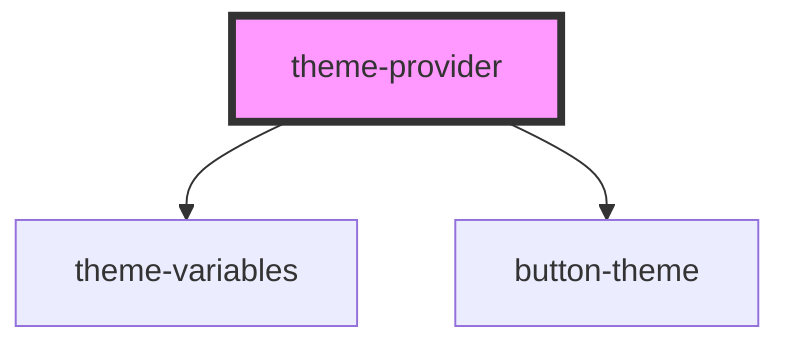

# a-button

<!-- Auto Generated Below -->

## Properties

| Property | Attribute | Description | Type     | Default  |
| -------- | --------- | ----------- | -------- | -------- |
| `theme`  | `theme`   |             | `string` | `'base'` |

## Dependencies

### Depends on

- [theme-variables](../variables)
- [button-theme](../button)

### Graph

----------------------------------------------

*Built with [StencilJS](https://stenciljs.com/)*
